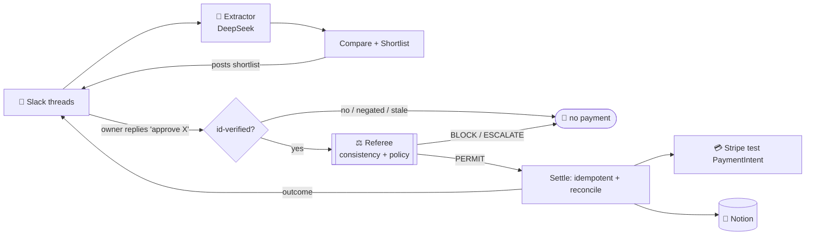

<div align="center">

# 🛒 ProofCart

### Compare what suppliers *actually* offered. Let the owner decide.

[](#-three-external-apps--one-llm)
[-00A67E)](#-three-external-apps--one-llm)
[](#-transaction-evidence--one-owner-approved-run)
[](#-what-this-prototype-contributes)

## ▶️ [**Watch the 2‑minute demo**](https://www.loom.com/share/7d9e7c2100a1404fbc9be4f16a613b29)

</div>

---

> [!NOTE]
> **Multi‑App AI Agent Hackathon submission.** The supplier conversations are **synthetic**, running over **real Slack, Stripe (test mode), and Notion** integrations — no real funds move. Every reliability claim below states its exact scope.

## The problem

An operations manager needs **20 sensor kits, delivered by Sep 18, for at most $1,000 including fees.** Their supplier chats are a mess: revised quotes, unanswered counteroffers, missing shipping costs, and delivery promises that miss the deadline. *Which offer should they actually buy — and how do they know an agent didn't get it wrong?*

**ProofCart reconstructs each supplier's *current* offer from Slack, compares cost and delivery against the request, and presents an owner‑reviewable shortlist. When the owner approves an exact quote — by replying in Slack — it settles a Stripe test payment and records the order in Notion.** The distinctive part is *before* the payment: telling a supplier's offer from an unaccepted buyer counter, and refusing to treat an incomplete quote as a real price.

## 🧾 The decision in our demo

Request: **20 × SENSOR‑KIT‑A**, ≤ **$1,000** all‑in, delivered **by 2026‑09‑18 17:00 UTC**.

| Supplier | Cost in the conversation | Delivery | Decision & reason |
|---|---:|---|---|
| **Acme** | $966.00 all‑in | Sep 16 | ✅ **Eligible** — lowest total among eligible offers |
| **Delta Gear** | $997.60 all‑in | Sep 17 | ✅ **Eligible** — the buyer's $43/unit counter is *unaccepted*; it is **not** the supplier's agreed price |
| **Bolt Supply** | $878.20 all‑in | Sep 24 | ❌ **Excluded** — cheaper, but arrives after the deadline |
| **Cirro Parts** | $915.20 *known subtotal* | — | ⚠️ **Needs clarification** — shipping unresolved, so the all‑in total is unknown |

Two offers qualify — we show **both**, rather than padding a "top five" with unsuitable ones. Supplier statements are evidence of the *quoted* terms, not proof that delivery will occur. (Evidence labels: *supplier‑stated · buyer‑counter‑unaccepted · shipping‑unknown · delivery‑late* — no invented confidence percentages.)

## 🔌 Three external apps (+ one LLM)

One agent, three external apps that hand off in a chain — *negotiations in → compared → money out → recorded*:

| App | Role | Action |
|---|---|---|
| 💬 **Slack** | the owner's interface | **reads** supplier threads, **posts** the shortlist, **waits for the owner's `approve <supplier>` reply**, posts the outcome |
| 💳 **Stripe** *(test mode)* | settlement | **creates & confirms** a `PaymentIntent` for the exact approved amount |
| 📝 **Notion** | durable record | **writes** the order (auto‑creating columns), idempotent by `order_id` |
| 🧠 **DeepSeek** *(→ OpenAI / Anthropic)* | the agent's brain | **extracts** typed offers from messy supplier free‑text |

## ✅ Transaction evidence — one owner‑approved run

A single coherent run (owner approved **in Slack**, verified by user id), pulled live from Stripe:

```
Request       req_demo_001  ·  20 × SENSOR-KIT-A, ≤ $1,000 all-in, by 2026-09-18
Owner action  replied "approve Acme" in #proofcart-demo (sender == configured owner id)
PaymentIntent pi_3UFM5tQ0nrgircmQ0Og54Nd9
  status      succeeded   ·   amount $966.00 USD   ·   amount_received $966.00
  livemode    false  (Stripe sandbox / test mode — no real money)
  created     2026-09-13T22:41:53 UTC
  metadata    { order_id: ord_2df995e43d8a, request_id: req_demo_001, quote_id: sup_acme-q1 }
```

Retrieve it yourself: **Stripe → Developers → Logs** shows the `POST /v1/payment_intents` with an `Idempotency‑Key` (proof a *program* made the call, not a human clicking) and the metadata linking the charge to *this* request and quote.

> [!NOTE]
> **Honesty on this packet:** the fields above are retrieved from the live PaymentIntent. An HTTP 200 or metadata alone is not proof of valid consent or supplier payout — the *approval* is the Slack reply from the owner id, and the supplier name in metadata is an audit reference, **not** a payout. A single fully‑screenshotted Slack→Notion→Stripe packet from one run is partially manual to assemble; treat this as the machine‑verifiable core.

## 🔬 What our evidence establishes

| Evidence | Scope | What it does **not** establish |
|---|---|---|
| `make evals` — **14 / 14** | Deterministic **local regression** cases via dev adapters (state machine, authorization, settlement) | Live model accuracy, all approval entry paths, or general integration reliability |
| Referee **replay 6 / 6** identical | Deterministic **rule execution** on recorded inputs | Independent truth of a supplier's claim |
| Slack + Stripe‑test + Notion run | A **seeded** purchasing workflow over real service APIs | Real supplier negotiation, supplier payout, delivery, or production readiness |
| Model extraction on unseen chats | **Not measured** by the regression score | (No broad extraction‑accuracy claim is made) |

**Scoreboard** (`make evals`, dev, deterministic — [`reports/scoreboard.md`](reports/scoreboard.md)):

| | 🛒 **ProofCart** | 🤖 NaiveCart _(safeguards removed)_ |
|---|:---:|:---:|
| Scenarios passed | **14 / 14** | 7 / 14 |
| Exactly‑one‑charge under crash / duplicate | **2 / 2** | 0 / 2 |
| Silent‑failure over‑claim | **0 / 3** | 1 |
| Unauthorized payments (in‑fixture) | **0** | 9 |
| Recovery success | **1 / 1** | 0 / 1 |

*NaiveCart* is a **combined ablation** (approval gate + safe‑retry + verification removed together) — an illustration of those safeguards, **not** a comparison against the strongest alternative agent or of model quality. "Zero unauthorized payments" refers to this fixture set, not a global guarantee.

## 💡 What this prototype contributes

ProofCart focuses on a distinction that matters in procurement: a **supplier offer**, an **unaccepted buyer counter**, an **accepted revision**, and an **owner‑approved purchase** are *different states*. Confusing them turns an attractive conversation into the wrong purchase.

It combines that negotiation interpretation with **deterministic checks** of totals, budget, and delivery, then presents the eligible options and unresolved terms for owner review. A **Referee** checks *consistency and policy* on the facts it receives — it does **not** independently establish that an extracted fact or a supplier promise is true (a made‑up price whose arithmetic balances still balances). Human approval, idempotency, and deterministic validation are established techniques; our contribution is their application to this purchasing workflow.

## 🧭 How it works



## 🛟 Crash‑safe payment

Persist the `PaymentIntent` id, carry a stable **idempotency key**, and after any uncertainty **reconcile by retrieving that exact object** — never a metadata search.

> [!NOTE]
> **Tested:** dropped‑response‑after‑charge and duplicate settle → **one** charge (`make evals`, 2/2). **Not tested:** a real OS process kill/restart, and losing the create response *before* the id is saved. We claim only what's demonstrated.

## 🚀 How to run

```bash
pip install -r requirements.txt
cp .env.example .env               # degrades to mocks if a key is blank

make demo                          # DEV: full flow, no keys
make approve-live                  # LIVE: posts the shortlist, WAITS for the owner's
                                   #       "approve <supplier>" reply in Slack, then pays
make evals                         # deterministic reliability scoreboard + baseline
```

<details><summary><b>Live setup (.env)</b></summary>

`DEEPSEEK_API_KEY` (or `OPENAI_/ANTHROPIC_`), `SLACK_BOT_TOKEN` + `SLACK_CHANNEL_ID`, `PROOFCART_OWNER_ID` (the only id that can approve), `STRIPE_SECRET_KEY` (`sk_test_…`), `NOTION_TOKEN` + `NOTION_DB_ID` (DB title column `order_id`), `PROOFCART_MODE=live`. Then `make seed` → `make approve-live`.
</details>

## 🐞 Failures discovered during development

Real bugs we hit and fixed while building — each with the fix and how it's now verified. *(We label a bug fixed only after verifying it.)*

| Failure we hit | Fix | Verified by |
|---|---|---|
| **Ghost suppliers** — Slack join/app‑added system messages parsed as empty `$0.00` suppliers | collector skips live threads with no supplier‑prefixed message | live read now reports **4 companies, no ghosts** |
| **Referee blocked every valid purchase** — it escalated even with a valid owner approval because supplier prices are always "supplier‑stated" | a valid owner approval clears supplier‑stated warnings → PERMIT; a *missing* field still escalates | referee self‑tests (approved supplier‑stated → PERMIT; no‑evidence → ESCALATE) |
| **Notion writes crashed** — `notion-client` v3 dropped `databases.query`; demo DB had only `order_id` | pin `notion-client<3`; **auto‑create missing columns** | live write + read‑back to the real DB |
| **Approval command crashed after approval** — `ShortlistItem.current` should be `.offer.current` | corrected both accesses | guard block runs with no error |
| **"do not approve Acme" was accepted** — parser matched `approve` anywhere | reject negated approvals; require `approve` + **exactly one named supplier** | 11 parser cases incl. negation/ambiguous/unrelated all handled |
| **A failed shortlist‑post let a stale approval authorize** — `after_ts` was set even on failure | **abort if the post fails** | — |
| **Demo could pay after a "no"** — later scripted sections injected approvals in live | live mode **returns after the owner's decision**; scripted illustrations are dev‑only | dev demo still shows all sections; live stops |
| **Slack rate‑limited the poll** — it fanned out to every thread's replies | poll `conversations_history` **once per tick, 7 s** | — |

## ⚠️ Honest limitations

> [!WARNING]
> - **Changed‑price is only *partly* solved.** The wrapper re‑checks the exact deal immediately before settling (catching a price change while the owner deliberates), but the engine still re‑extracts at execution — carrying the immutable approved terms all the way through is **not done**, so a sub‑second window remains. *Open item.*
> - **Approval is a Slack reply we poll for and check the sender id** — not a cryptographically **signed** Slack request/button callback (future work).
> - **Single executor** — no cross‑process admission constraint; **no concurrent‑worker safety claim**.
> - Supplier is **simulated**; Stripe is **test mode**; metadata is an audit reference, **not a payout**.
> - The Referee flags claims with no tool evidence; it **cannot** verify a claim that's consistent with a wrong tool result. The buyer LLM is injectable (shown); the Referee is not an LLM and never reads supplier free‑text.
> - The eval is a **deterministic regression suite**, doesn't measure DeepSeek extraction accuracy, and no ROI/time‑saved is measured. This is a **workflow prototype**, not a deployed product.

<details><summary><b>Research this builds on (technique, not a guarantee)</b></summary>

Evidence‑gated authorization ([2605.19192](https://arxiv.org/abs/2605.19192)) · durable replay‑resistant settlement / verify‑before‑retry ([2608.01710](https://arxiv.org/abs/2608.01710), [2608.02645](https://arxiv.org/abs/2608.02645)) · silent‑failure characterization ([2606.09863](https://arxiv.org/abs/2606.09863)) · environment‑as‑verifier ([2605.13909](https://arxiv.org/abs/2605.13909)) · effect‑level payment eval under faults ([2609.04706](https://arxiv.org/abs/2609.04706)). We implement rule‑based versions of these ideas; a citation is not proof the paper's guarantees hold in this code.
</details>

---

<div align="center">

**ProofCart** · reconstruct what suppliers offered · let the owner decide · settle it safely.

### ▶️ [Watch the 2‑minute demo](https://www.loom.com/share/7d9e7c2100a1404fbc9be4f16a613b29)

</div>
